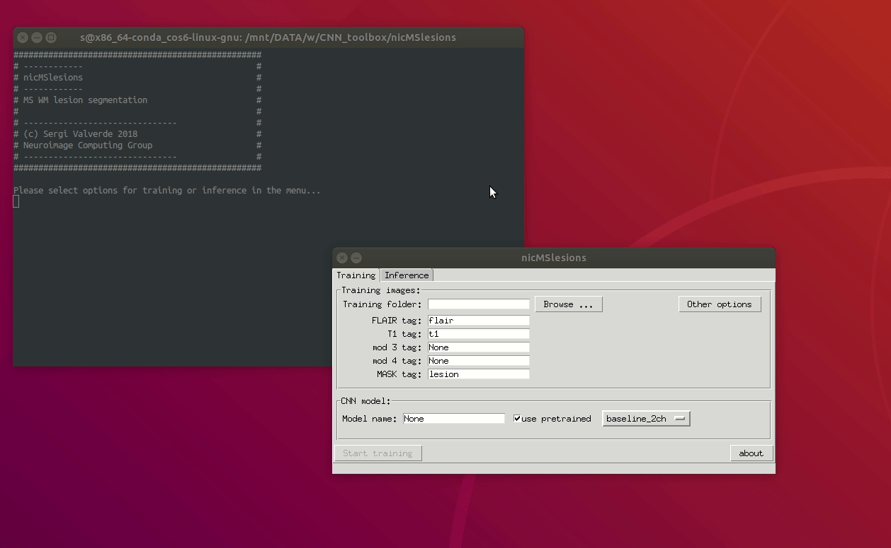
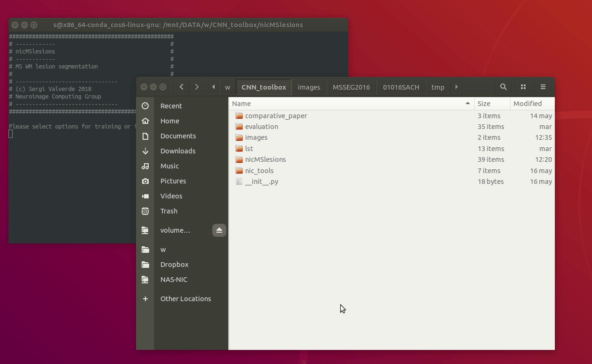
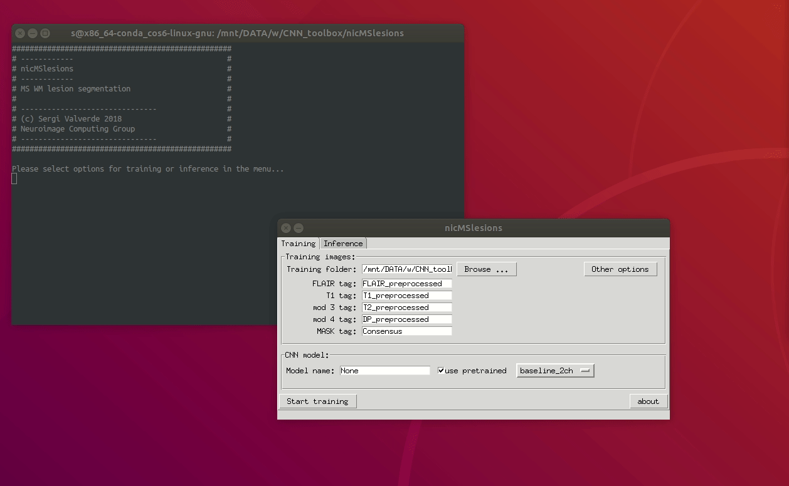
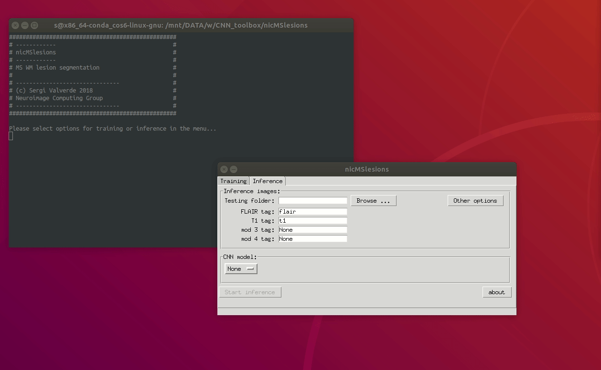
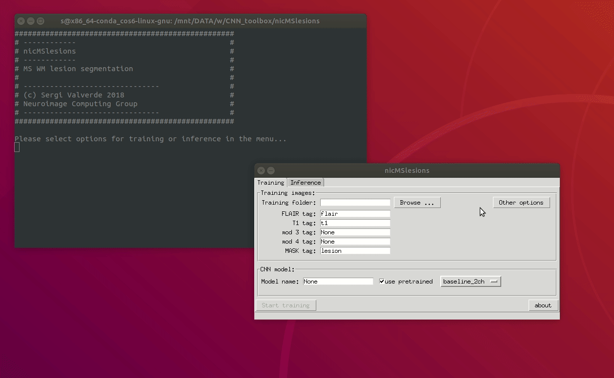

# NicMSlesions



Easy multiple sclerosis white matter lesion segmentation using convolutional deep neural networks.


# About:

NicMSlesions makes it easy to accurately segment white matter (WM) lesions on Magnetic Resonance Images (MRI) using supervised deep learning. With nicMSlesions, training and/or inference of a complex neural network model is performed with just a few mouse clicks. More interestingly, nicMSlesions can be trained with a very small set of annotated images, which can be very interesting to facilitate the use of supervised deep learning on the fairly amount of yet unlabeled data.

NicMSlesions graphical user interface (GUI) is inspired on the classical [FSL](https://fsl.fmrib.ox.ac.uk/fsl/fslwiki) software, a widely well-known neuro-imaging toolbox. As some of the most common tools in FSL, nicMSlesions can be run both under a GUI or via scripting.

NicMSlesions has been tested on Windows and GNU/Linux systems. Although is possible to run it on CPU, it is based on a set of 3D convolutional layers, so using a GPU with [cuda](https://developer.nvidia.com/cuda-zone) capabilities is highly recommended.


# Requirements:

* A decent machine running GNU/Linux or Windows. Deep learning methods
  are computationally expensive, so at least 8GB of RAM is necessary
  to train a new model. Although this limitation can be addressed
  using data generators, at this particular version of nicMSlesions we
  have avoided this option in order to speed up training, so 16GB is
  definitely highly recommended. For performing only inference, RAM
  requirements are more modest.

  The current version is based on [Keras](https://keras.io), so the
  following softwares are necessary to run the program:


* A running [Python](https://www.python.org) environment. We highly recommend using the [Anaconda](https://conda.io/docs/user-guide/install/index.html) distribution.

* [Git](https://git-scm.com/downloads).

* [CUDA](https://developer.nvidia.com/cuda-zone). If you plan to use nicMSlesions using a GPU, please be sure that your computer has the appropriate [CUDA libraries](https://developer.nvidia.com/cuda-zone) installed.
    * On Windows, [this guide](http://www.islandman93.com/2016/04/tutorial-theano-install-on-windows-7-8.html) shows how to install Theano and CUDA.
	* On GNU/Linux, [this guide](http://docs.nvidia.com/cuda/cuda-installation-guide-linux/#axzz4WNL7OgLr) is an excellent resource to install CUDA on a different range of distributions.

	In the case of CPU, be sure that the fast linear algebra [libraries](http://lasagne.readthedocs.io/en/latest/user/installation.html#numpy-scipy-blas) are also installed.

* [Theano](http://deeplearning.net/software/theano/). The easiest way
to install Theano and its dependencies is also through using
[Anaconda](http://deeplearning.net/software/theano/install_ubuntu.html#requirements-installation-through-conda-recommended). [Tensorflow](https://www.tensorflow.org/ "Tensorflow")
could be also used but be sure that ```image data format``` is set to
`channels_first` in your `keras.json` configuration file.

# Installation:

Once these requirements are met, the rest of python libraries may be easily installed using ```pip```:

```bash
git clone https://github.com/sergivalverde/nicMSlesions.git
cd nicMSlesions
pip install -r requirements.txt
```

Optionally, you may want to add nicMSlesions to your system path for future use.


# Data and image specifications:

At this moment, nicMSlesions only accepts [nifti](https://nifti.nimh.nih.gov/) images. For each subject, FLAIR and T1-w images are mandatory to infer segmentation, while an additional binary lesion mask delineated on the FLAIR image sequence is also mandatory to train a new model. Future versions will incorporate [DICOM](https://en.wikipedia.org/wiki/DICOM) images.

After converting images to [nifti](https://nifti.nimh.nih.gov/), raw images can be used as input. By default, the T1-w image is registered internally (affine) to the FLAIR space and skull stripping is performed, so there is no need to register or pre-process the input modalities before running nicMSlesions.


# How to run it:

### Training: ###

The simplest way to train a new model is via the GUI. On a terminal, just run `nicMSlesions.linux` on GNU/Linux or `nicMSlesions.win.bat` on Windows. Click on the training tab.

1. Select training folder. Browse the folder containing a set of training subjects.

	

	So far, nicMSlesions expects to find training subjects in separated folders. For instance:

	

2. Select at least T1-w and FLAIR identification tags. Generally,
   image databases tend to have a unique identifier for each of the
   MRI sequences, so here the user has only to provide a valid tag for
   each of the input modalities, and nicMSlesions will do the
   rest. For instance, if FLAIR images follows
   `patient-id_flair.nii.gz` nomenclature, just setting the FLAIR tag
   to `flair` will be enough to ensure that all FLAIR images will be
   loaded for each of the training subjects inside the
   `training_folder`. So far, nicMSlesions supports up to 4 input modalities:

	


3. Set up a name for the training model and/or select a pre-trained
   model from the library.

	


	If the `use pretrained` toggle button is pressed, a pre-trained model can be selected from either a predetermined model `baseline` or from a previous training session. Using a pretrained model, a new training session can be run with just a couple of new training images. This may be very interesting for instance to train a model on a new image domain where just a few annotations are available or also to update an already trained model with new training samples. However, the more the training available subjects, the better the accuracy on the target image domain.


4. Configure other options. In most of the cases, the previous three steps are sufficient to train a new model. However, additional options are available to tune on the `other options` menu.


	

	The following number of parameters can be tuned:

	* Data options:

		* **Register modalities**: by default, the T1-w sequence is registered to the FLAIR space. Disable this option if images are already registered accordingly.
    	* **Skull-stripping**: remove skull before processing the
          data. By default, all images are skull-stripped. Disable
          this option if images are already skull-stripped.

        * **Denoising**: denoise the images before processing. The
            number of iterations can be controlled by the parameter
            `denoise_iter`.

    	* **Save tmp files**: save intermediate images used during processing (registration matrices, registered and skull-stripped masks, etc...)
    	* **Show debug messages**: show some interesting messages when running that can be useful to debug possible errors.

    * Model options:

    	* **Max epochs**: maximum number of epochs to train the network.

    	* **Validation %**: percentage of the training samples that are used to validation. 25% of the samples are used by default.

    	* **Test batch size**: number of samples inferred at the same time. This parameter is important and it is directly related with your RAM memory. Reduce this around 5000 on machines with less than 8GB of RAM.

    	* **Mode**: select GPU or CPU processing. Set this options to `cudaX` where `X` is the cuda device to use (`cuda0` in most of the cases). Set the parameter to `cpu` otherwise.

    	* **Verbosity**: set the output verbosity of the network model. Setting this parameter to 1 prints the training procedure for each of the epochs. This can be interesting when training a new method. If not necessary keep it to `0` to reduce messages.

    * Post-processing:

    	* **Out probability th**: set the minimum lesion output probability. Selecting lower values `th < 0.5` for this parameter increases the sensitivity of the method, of course at the cost of increasing also the number of false positives. Setting this parameter to values between `0.5` and `0.8` is recommended in most of the configurations.

    	* **Min out region size**: set the minimum lesion output size. This parameter is related to the image resolution. Setting this parameter to `10` is recommended in most the cases.

    * **Minimum volume error **: Minimum error that the program can
      handle (in ml.). Segmentations with a resulting error < than the
      selected minimum error will be discarded.
5. Finally, click the `start training` button to start a training session.


## Inference:

Very similarly click on the inference tab to start the program.

1. Select the inference folder. Browse folder containing a set of inference subjects. The same folder structure is expected for inference.

	

2. Similarly to training, select T1-w and FLAIR identification tags.

3. Select an available training model from the list.

4. Click the `start inference` button to perform WM lesion segmentation.

5. Validate results. A new folder should appear with the net model name when finished. Both probabilistic and final hard segmentation will be there.

# Batch processing:

NicMSlesions can be also run without the GUI application. For doing so, simply use the provided `nic_train_network_batch.py` and `nic_infer_segmentation_batch.py`. Both scripts can be run after setting the configuration file located at `config/configuration.cfg`. Basically, the same parameters shown above can be configured using this file. For instance:

```python

[database]
train_folder = /path/to/the/training/folder
inference_folder = /path/to/the/inference/folder
flair_tags = FLAIR_TAG
t1_tags = T1_TAG
mod3_tags = None
mod4_tags = None
roi_tags = MASK_TAG
register_modalities = True
skull_stripping = True
save_tmp = True
debug = False

[train]
full_train = False
pretrained_model = baseline

[model]
name = net_name
pretrained = None
train_split = 0.25
max_epochs = 200
patience = 25
batch_size = 50000
net_verbose = 0
mode = cuda0

[postprocessing]
t_bin = 0.8
l_min = 20
min_error = 0.5
```
Once the configuration file is set, just train a new model with:
```
python nic_train_network_batch.py
```

or infer lesion segmentation with:
```
python nic_infer_segmentation_batch.py
```

# Default parameters:

Default values for each of the available parameters can be set on the `config\default.cfg` script. Configured values in this file will appear as default ones when the GUI application is started. Once these parameters are set, there is no need to adjust them again in either the GUI application or the configuration file. For instance, after setting default values, a valid `config\configuration.cfg` file could be:

```python

[database]
train_folder = /path/to/the/training/folder
inference_folder = /path/to/the/inference/folder
flair_tags = FLAIR_TAG
t1_tags = T1_TAG
roi_tags = MASK_TAG

[train]
full_train = True

[model]
name = net_name
```

# Update:

Updating NicMSlesions to a new version can be done both via GUI and command line. To check a new version of the software, press the `about` button on the main window and then `Check for updates`:




Of course, more advanced users can update the software pulling the latest version from the repository using:

```
cd /where/nicMSlesions/lives
git pull origin master
```


# License:

This software is released under the version 3 of the GNU General Public License. Please read the license terms before using the software. A copy of this license is present in the root directory.

# Cite:

If you use this software, please cite it as:

```

@article{Valverde2018,
archivePrefix = {arXiv},
arxivId = {1805.12415},
author = {Valverde, Sergi and Salem, Mostafa and Cabezas, Mariano and Pareto, Deborah and Vilanova, Joan C. and Rami{\'{o}}-Torrent{\`{a}}, Llu{\'{i}}s and Rovira, {\`{A}}lex and Salvi, Joaquim and Oliver, Arnau and Llad{\'{o}}, Xavier},
eprint = {1805.12415},
file = {:tmp/mozilla{\_}s0/1805.12415.pdf:pdf},
keywords = {automatic lesion segmentation,brain,convolutional neural networks,mri,multiple sclerosis},
pages = {1--13},
title = {{One-shot domain adaptation in multiple sclerosis lesion segmentation using convolutional neural networks}},
url = {http://arxiv.org/abs/1805.12415},
year = {2018}
}

```

# Bibliography:

1. Valverde, S., Salem, M., Cabezas, M., Pareto, D., Vilanova, J. C., Ramió-Torrentà, L., … Lladó, X. (2018). One-shot domain adaptation in multiple sclerosis lesion segmentation using convolutional neural networks, 1–13. Retrieved from http://arxiv.org/abs/1805.12415

2. Valverde, S., Cabezas, M., Roura, E., González-Villà, S., Pareto, D., Vilanova, J. C., … Lladó, X. (2017). Improving automated multiple sclerosis lesion segmentation with a cascaded 3D convolutional neural network approach. NeuroImage, 155, 159–168.
